# Mermaid Tutorial

## Sequence Diagram

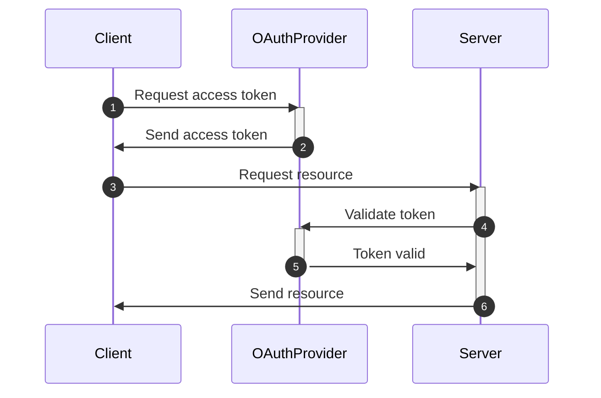

## Flow Chart

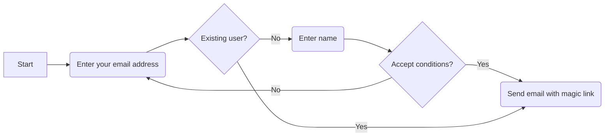

## Class Diagram

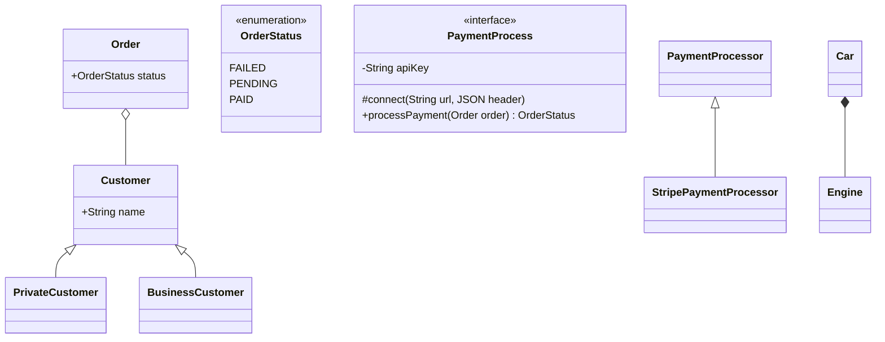

## Entity Relationship Diagram

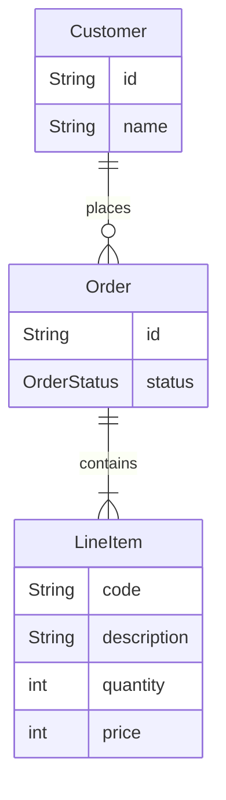

## Node

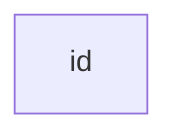

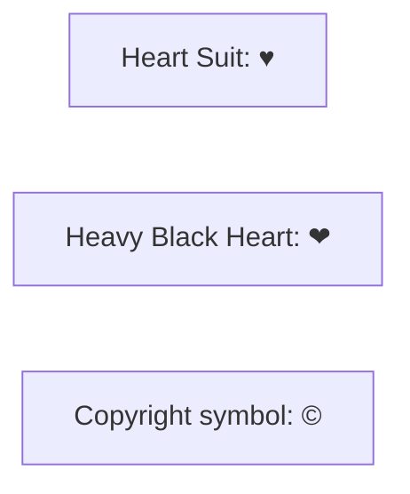

Direction
- TB, TD, BT, RL, LR
- (round edge)
- ([statium-shaped])
- [[subroutine shaped]]
- [(database shaped)]
- ((circle node))
- >sasymmetric node]
- {rhomubs}

## Shapes

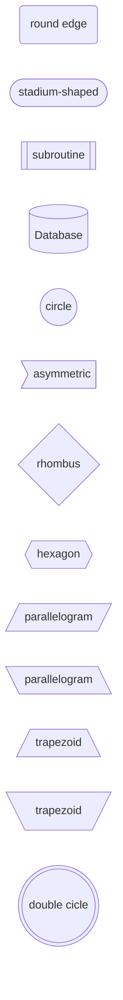

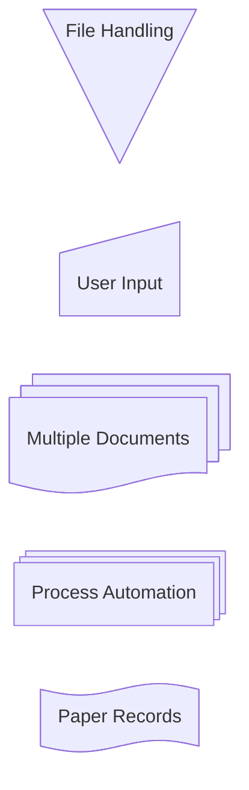

## Gantt

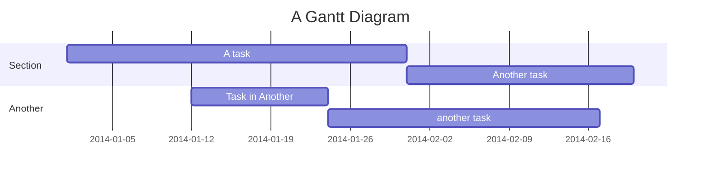

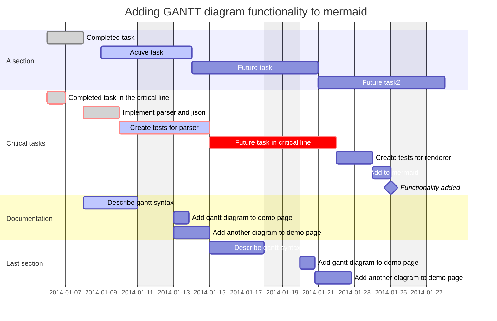

## Pie Chart

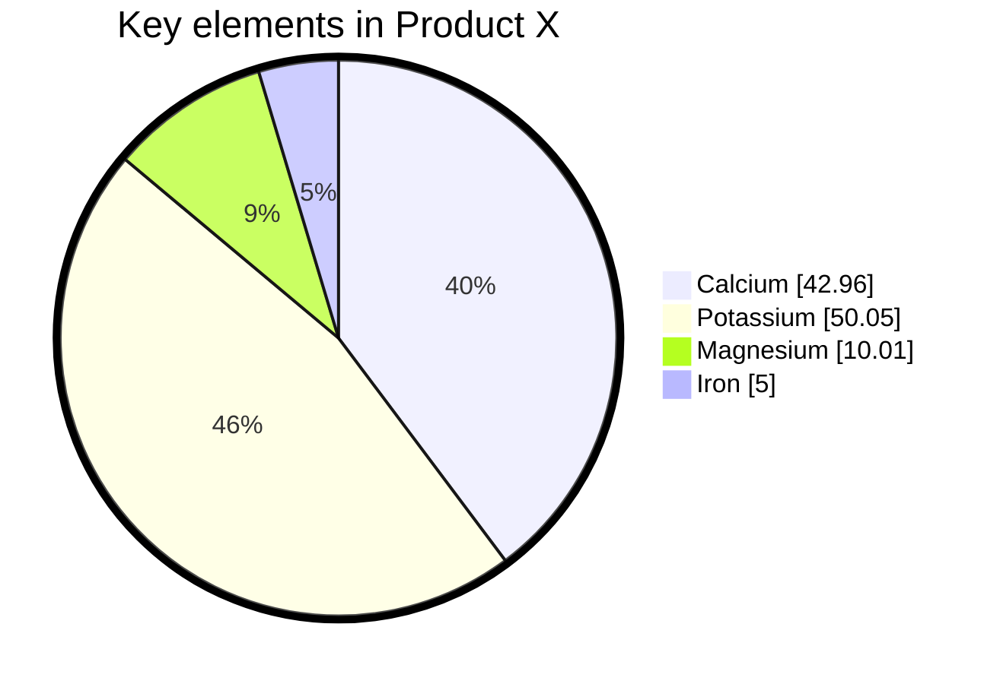

## Mindmap

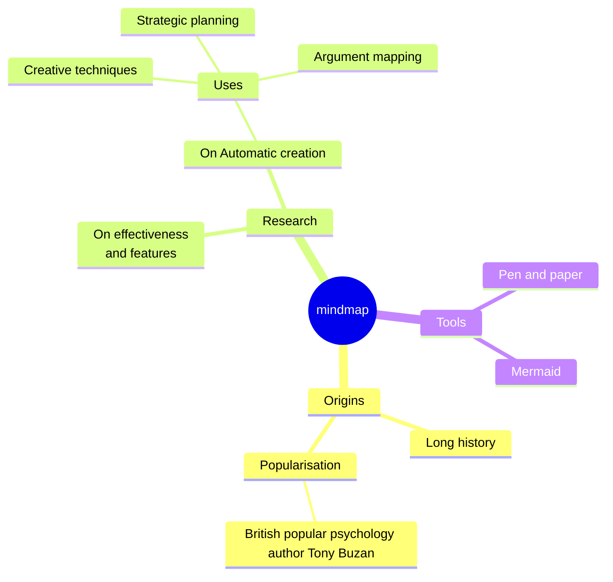

## Timeline

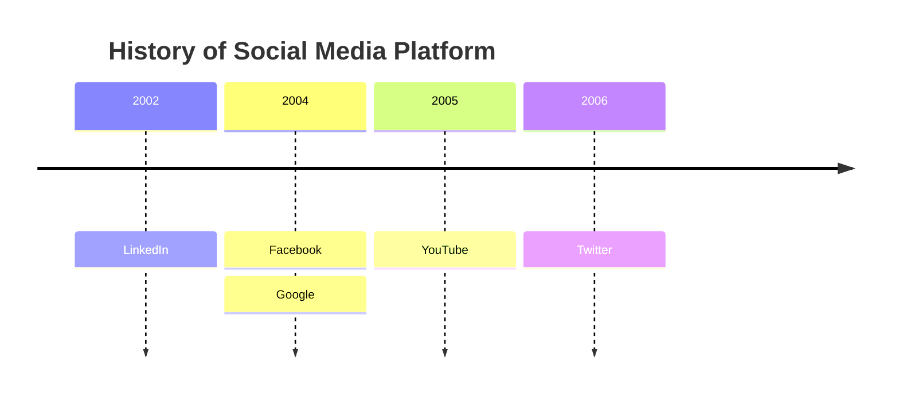

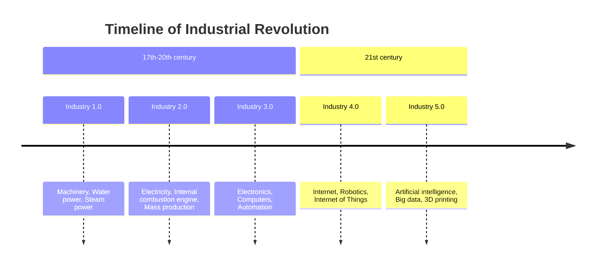