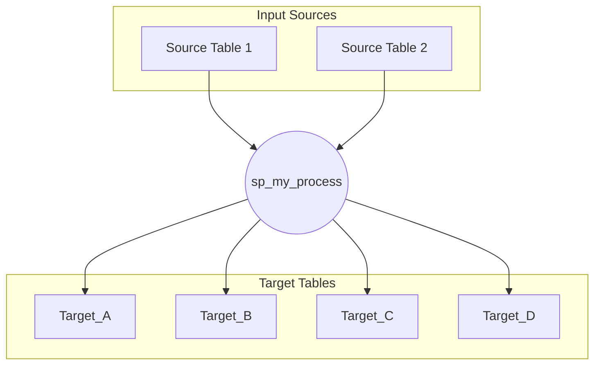

# Mermaid Tutorial

## Sequence Diagram

```mermaid
graph TD
    %% 1. Define the Sources (Inputs)
    subgraph Input Sources
        ST1[Source Table 1]
        ST2[Source Table 2]
    end

    %% 2. Define the Process (Stored Procedure)
    SP((sp_my_process))

     %% 3. Define the Targets (Outputs)
    subgraph Target Tables
        TA[Target_A]
        TB[Target_B]
        TC[Target_C]
        TD[Target_D]
    end

        %% 4. Define the Flow
    
    %% Sources feed into the stored procedure
    ST1 --> SP
    ST2 --> SP
    
    %% Stored procedure writes to the target tables
    SP --> TA
    SP --> TB
    SP --> TC
    SP --> TD
```
